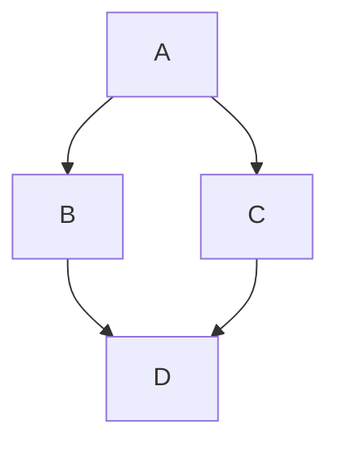

<!-- PROJECT LOGO -->
<br />
<div align="center">
  <a href="#">
    
  </a>

  <h3 align="center">go-grip</h3>

  <p align="center">
    Render your markdown files local<br>- with the look of GitHub
  </p>
</div>

## Table of Contents

- [About](#question-about)
- [Features](#zap-features)
- [Getting started](#rocket-getting-started)
- [Usage](#hammer-usage)
- [Examples](#pencil-examples)
- [Known TODOs / Bugs](#bug-known-todos--bugs)
- [Similar tools](#pushpin-similar-tools)

## :question: About

**go-grip** is a lightweight, Go-based tool designed to render Markdown files locally, replicating GitHub's style. It offers features like syntax highlighting, dark mode, and support for mermaid diagrams, providing a seamless and visually consistent way to preview Markdown files in your browser.

This project is a reimplementation of the original Python-based [grip](https://github.com/joeyespo/grip), which uses GitHub's web API for rendering. By eliminating the reliance on external APIs, go-grip delivers similar functionality while being fully self-contained, faster, and more secure - perfect for offline use or privacy-conscious users.

## :zap: Features

- :zap: Written in Go :+1:
- 📄 Render markdown to HTML and view it in your browser
- 📱 Dark and light theme
- 🎨 Syntax highlighting for code
- [x] Todo list like the one on GitHub
- Support for github markdown emojis :+1:
- Support for mermaid diagrams
- hashtag linking in page (see table of contents)
- math expressions (code, inline, block)
- gh issues and prs #46 and grafana/grafana#22
- toggle state is preserved in [sessionStorage](https://developer.mozilla.org/en-US/docs/Web/API/Window/sessionStorage)

This is an inline $\sqrt{3x-1}+(1+x)^2$ function.

$$\left( \sum_{k=1}^n a_k b_k \right)^2 \leq \left( \sum_{k=1}^n a_k^2 \right) \left( \sum_{k=1}^n b_k^2 \right)$$

```math
\left( \sum_{k=1}^n a_k b_k \right)^2 \leq \left( \sum_{k=1}^n a_k^2 \right) \left( \sum_{k=1}^n b_k^2 \right)
```



```go
package main

import "github.com/nickfujita/go-grip/cmd"

func main() {
	fmt.Sprintln("Welcome to Grip! Use `go-grip --help` for more information.")
}
```

> [!TIP]
> Support of blockquotes (note, tip, important, warning and caution) [see here](https://github.com/orgs/community/discussions/16925)

> [!IMPORTANT]
>
> test

## :rocket: Getting started

To install go-grip, simply:

```bash
go install github.com/nickfujita/go-grip@latest
```

> [!TIP]
> You can also use nix flakes to install this plugin.
> More useful information [here](https://nixos.wiki/wiki/Flakes).

## :hammer: Usage

To render the `README.md` file simply execute:

```bash
go-grip README.md
# or
go-grip
```

The browser will automatically open on http://localhost:6419. You can disable this behaviour with the `-b=false` option.

You can also specify a port:

```bash
go-grip -p 80 README.md
```

or just open a file-tree with all available files in the current directory:

```bash
go-grip -r=false
```

It's also possible to activate the darkmode:

```bash
go-grip -d .
```

To disable automatic browser reload on file changes (useful for stable editing):

```bash
go-grip --no-reload README.md
```

To layer your own styling on top of the built-in theme, pass one or more
stylesheets with `--css`. Each file is linked after the theme stylesheet, so its
rules win the cascade. The flag is repeatable and files are applied in order:

```bash
go-grip --css brand.css README.md
# or stack several
go-grip --css base.css --css overrides.css README.md
```

A missing `--css` path fails immediately at startup with a clear error.

### Custom themes

Besides the built-in `light`, `dark`, and `auto` modes, `--theme` accepts a
custom theme name. A name that is not one of the built-ins resolves to a
stylesheet in your themes directory:

```
$XDG_CONFIG_HOME/go-grip/themes/<name>.css   # defaults to ~/.config/go-grip/themes/<name>.css
```

For example, with `~/.config/go-grip/themes/nightshade.css` in place:

```bash
go-grip --theme nightshade README.md
```

By default a custom theme **layers on top of the built-in dark base**, so you
only need to write the overrides you care about. Change the base with an
optional first-line directive:

```css
/* go-grip-base: light */   /* layer on the light base instead */
/* go-grip-base: none */    /* no built-in base; your theme stands alone */
```

If the named theme file does not exist, startup fails with an error that lists
the path it searched and the theme names that are available.

To terminate the current server simply press `CTRL-C`.

## :pencil: Examples


## :bug: Known TODOs / Bugs

- [ ] Make it possible to export the generated html

## :pushpin: Similar tools

This tool is a Go-based reimplementation of the original [grip](https://github.com/joeyespo/grip), offering the same functionality without relying on GitHub's web API.
